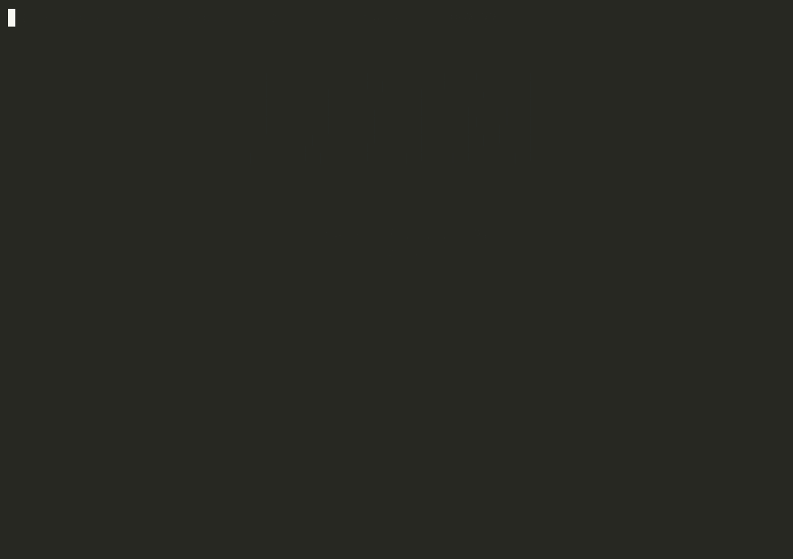
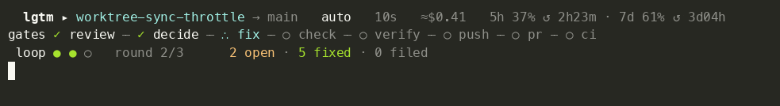
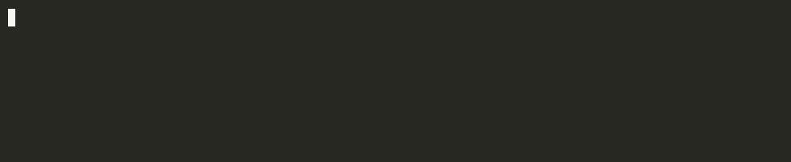

# LGTM

**Fresh eyes on your branch before the PR opens.**

<p align="center"></p>

Run it instead of `gh pr create`. It reads your diff, tells you what a careful reviewer would have said, fixes what you tell it to, opens the pull request, and watches CI.

```
$ lgtm

 lgtm · worktree-sync-throttle → main      2 findings need a decision      ≈$0.41

 FINDINGS
 ▶ 1  block  src/main/sync.ts:140         swallowed-error                        [ undecided ]
   2  ask    src/main/sync.test.ts:88     missing-assert                         [ undecided ]

 FINDING 1 · correctness · src/main/sync.ts
    136   export async function flush(batch: Event[]) {
    137     const started = Date.now()
    138 +   try {
    139 +     await push(batch)
 ▶  140 +   } catch (err) { /* retry later */ }
    141     log(started)
    142   }
    143
   The retry never happens — nothing schedules it. Either enqueue the retry here or let the
   error surface; silently dropping it means a failed sync looks identical to no sync.

 WHAT DO YOU WANT TO DO WITH FINDING 1?
    ▶ Fix      Accept      Dismiss      Skip
   ↑↓ pick a finding · ←→ pick an action · Enter to apply · A autopilot · q quit for now
```

And between your decisions, the run itself:

```
 lgtm · worktree-sync-throttle → main      ⠋ fix · round 2 of 3      ≈$0.62

 GATES
   ✓ review    4 lenses · 7 found
   ✓ decide    3 fixed · 1 accepted · 0 dismissed
   ⠋ fix       agent working on 3 finding(s)
   ○ check
   ○ verify
   ○ push
   ○ pr
   ○ ci

 ROUNDS  ● ◐ ○    round 1: 3 fixed · 1 filed · 3 open

 q cancel
```

Eight gates. The middle four (decide, fix, check, verify) cycle: fixes go in, your checks run on them, each fix is confirmed against the new diff, and anything still open comes back to you for the next round. The set of findings only ever gets shorter, so it always finishes.

## Why

You already run the tests before you push. What you usually don't have is someone who read the change. Reviewers are busy, and the bugs that get through tend to be the kind a second pair of eyes catches in thirty seconds. `lgtm` is that second pair of eyes, on your machine, before anyone else has to spend theirs.

It uses whatever coding agent you already pay for. With Claude Code, that's your subscription.

## Install

```sh
go install github.com/richdapice/lgtm@latest
```

You need `git`, `gh` logged in, and a review agent on your PATH. `claude` works out of the box. Others take one config entry, described below.

```sh
cd your-repo
lgtm init            # finds your projects, asks a few questions, writes .lgtm.toml
lgtm doctor          # makes sure the agent answers
```

Then, on a branch with your work committed:

```sh
lgtm
```

## A run, start to finish



First it reads the diff. Four lenses look at what changed between your branch and its base: correctness, your project's conventions (it reads `CLAUDE.md` and `AGENTS.md` if you have them), security, and tests. A lens is a paragraph telling the reviewer what to look for; you can add your own in `.lgtm.toml`. That's one agent call by default. The agent can read the rest of the repo while it thinks, which is where the good findings come from. The one above needed to know that nothing else in the file scheduled a retry.

Then it shows you what it found. Each finding is a `block` (must be fixed), an `ask` (your call), or a `file` (worth writing down, no need to stop). The `file` ones are recorded and stay out of your way. The rest go in the panel, one at a time, with the lines they point at.

You decide. Each finding is numbered, its decision is spelled out next to it, and the panel asks what you want to do with the one you're on. Pick an action, press Enter. Nothing happens until you do. When every finding has a decision, Enter once more submits the round.

The agent makes the fixes in your working tree. Your own checks then run on the files it touched (`vitest related`, `eslint`, `go vet`, whatever `init` found), and only a green result gets committed. A fix that breaks the tests is reverted, and you see why. After that it checks each finding you asked to fix against the new diff. This goes up to three rounds. Then it either ships or hands the rest back to you.

Finally it pushes, writes the PR body from the diff and the literal check output, opens the PR, and reacts 👀 from your account. It watches CI and reacts 👍 when that's green. It doesn't touch the PR again after that.

```
round 1/3: 2 fixed · 0 filed · 0 open

  ╭──────╮
  │ LGTM │  2 found · 2 fixed · 0 accepted · 0 filed · 3m48s · ≈$1.10
  ╰──────╯
  https://github.com/you/repo/pull/126
```

If it stops short, it says what for, and running `lgtm` again picks up where it left off without a second review:

```
  not yet — 1 need you:
    ask   website/src/app/page.tsx:887  landscape-film-illegible-on-phones · fixer declined, needs your decision
  run `lgtm` to decide.
```

## Deciding

The panel draws under your prompt, so there's no full-screen takeover and your scrollback stays. It's never wider than 100 columns.

| | |
|---|---|
| `↑` `↓` | pick a finding |
| `←` `→` or `f` `a` `d` `s` | pick an action: Fix, Accept, Dismiss, Skip |
| `Enter` | apply it to that finding, then move to the next undecided one |
| `Enter` again, once every finding has a decision | submit the round |
| `A` | hand the rest to autopilot |
| `q` | quit for now; the run waits and `lgtm` resumes it |

What each action means:

| | |
|---|---|
| Fix | the agent changes the code; your checks run on it before it's committed |
| Accept | seen it, it's fine as-is |
| Dismiss | never show this again; it goes on a list you commit with the repo |
| Skip | not now; it stays open and the PR body says so |

Sometimes the agent won't fix something because it needs a design decision first ("crop the video for phones, or re-render it?"). It says so, and its reason stays on the finding. You can answer with a direction: `lgtm decide 0fe5 fix -m "crop it"`.

Autopilot is the default. It doesn't ask: every finding goes to the agent with the judgement calls delegated, whatever comes back unfixed is noted in the PR body, and the PR opens. If a `block` shipped unfixed, the PR opens as a draft. `lgtm --manual` asks you about each finding instead, in the panel above, and `mode = "manual"` in `.lgtm.toml` makes that the default for a repo.

`--plain` swaps the panel for line prompts, which is also what you get when stdout isn't a terminal.

## On every push

```sh
lgtm push            # review, fix, commit, then git push — one command, no PR
lgtm init --hook     # or: make plain `git push` do the same, every time
```

`lgtm push` is the simple one: it does the review before the push, so what goes up is what was fixed. The hook is for when you'd rather keep typing `git push`.

The hook installs as `pre-push`, so every `git push` in the repo is reviewed and fixed first, without asking — autopilot, review only, no PR. Nothing leaves until it's been read. Git has already chosen the commit by the time a hook runs, so if lgtm commits fixes it stops the push and says `push again`; the second push is instant, because a tree that's been through a full run is remembered. Pushing the base branch passes straight through, and `git push --no-verify` skips it when you mean to.

## From anywhere

A waiting run shows in the status bar of every Claude Code session, so you shouldn't have to hunt for the right terminal to act on it.

```sh
lgtm -b my-branch                       # the panel for that branch, from any directory in the repo
lgtm decide 0fe5 accept -b my-branch    # record a decision without a terminal; id prefixes are fine
lgtm continue -b my-branch              # apply what's recorded, run the round, open the PR
lgtm continue --auto -b my-branch       # …and autopilot the rest
```

`lgtm init --skill` installs a `/lgtm` skill for Claude Code. In any chat, `/lgtm` shows what's waiting; you say "accept the first, fix the second"; it records that and continues.

## The status bar

`lgtm init --statusline` adds a live bar to Claude Code's status line. It renders in about four milliseconds and changes shape with the run:





```
── a review in flight
  lgtm ▸ worktree-sync-throttle → main   manual   1m12s   ≈$0.41   5h 37% ↺ 2h23m · 7d 61% ↺ 3d04h
      ─ review        ████████▊░░░░     –   opus      1m12s

── mid-run, at the verify gate (lenses shown here because fanout = "parallel")
  lgtm ▸ worktree-r2-incremental-cache → main   manual   2m14s   ≈$0.09
gates ✓ review ─ ✓ decide ─ ✓ fix ─ ✓ check ─ ∴ verify ─ ○ push ─ ○ pr ─ ○ ci
 loop ● ● ○  round 2/3      0 open · 0 fixed · 0 filed

── waiting on you
  lgtm ▸ worktree-sync-throttle → main   2 need you   3m16s   ≈$0.62
 loop ● ● ●  round 3/3      2 open · 8 fixed · 3 filed
    → lgtm -b worktree-sync-throttle · or /lgtm in Claude Code

── PR open, watching CI
  lgtm ▸ worktree-sync-throttle → main   passed   4m01s   ≈$0.71
   ci ◍ #126   ▰▰▱▱   check 2/4 · 1m12s

── idle
  lgtm ▸ main   idle   12 runs today   5h 37% ↺ 2h23m · 7d 61% ↺ 3d04h
      20 runs  ▂▃▂▅▂▂▇▃▂▂▄▂▃▂▂▃▅▂▂▃  median 2m38s · 3 held · streak 4
```

While it reviews, the bright bar is whichever lens is running. After that the gate track takes over: ✓ passed, ∴ now, ○ ahead. Idle shows your last twenty runs as a sparkline and how many in a row shipped without needing you. `#126` is a link. `5h 37% ↺ 2h23m` is your subscription's 5-hour window, how much of it is used and when it resets, and `7d` is the weekly one. They show whenever Claude Code passes them along.

## Configuration

`init` writes `.lgtm.toml` at the repo root. The part you'll actually edit is which commands check which files:

```toml
[lgtm]
mode = "auto"            # auto | manual
max_fix_rounds = 3       # decide → fix → check → verify cycles before it stops
dispatch = "batch"       # batch: one call with every lens · parallel: one call per lens
# passes = ["sonnet", "opus"]   # review twice: a cheap read, then a stronger second opinion
# max_budget_usd = 0.75  # cap per agent call; 0 = none

[lens.conventions]
model = "haiku"          # per-lens model when dispatch = "parallel"

[lens.perf]              # a lens of your own: name it, say what it looks for
prompt = "hot paths doing more work than they need to; N+1 queries; work inside loops that could happen once"

[pr]                     # what it leaves on the pull request
reactions = true         # false turns both off
on_open = "eyes"         # +1 -1 laugh confused heart hooray rocket eyes, or "" for none
on_green = "+1"
# comment = "reviewed by lgtm: {found} found · {fixed} fixed · {filed} noted · {rounds} round(s) · ≈{cost}"

[[project]]              # monorepos: first path-prefix match wins, so "." goes last
path = "website"
test = ""                # empty = skipped, and reported as skipped, never as a pass
lint = "npm run typecheck"

[[project]]
path = "."
test = "npx vitest related {files} --run"
lint = "npm run typecheck && npx eslint {files}"
```

Agents live in `~/.config/lgtm/config.toml`. Anything that reads a prompt on stdin and answers on stdout will do:

```toml
default_agent = "claude"

[[agent]]
name = "claude"
command = ["claude", "-p", "--restricted", "--permission-prompts", "none", "--output-format", "json"]
fix_command = ["claude", "-p", "--permission-mode", "acceptEdits", "--permission-prompts", "none",
               "--allowedTools", "Read,Edit,Write,Grep,Glob", "--output-format", "json"]
schema = "native"        # the CLI validates JSON against a schema itself
model = "opus"

[[agent]]
name = "copilot"
command = ["copilot", "-s", "--no-ask-user", "--deny-tool", "shell", "--deny-tool", "write"]
schema = "prompt"        # schema goes in the prompt; the reply is parsed leniently, then validated
```

There are two commands per agent because reviewing and fixing are different jobs. The reviewer can read but not run anything. The fixer can edit but not run anything. Your checks are the only thing that executes code.

## Costs

The `≈$` figures are what a call would cost at API list price, worked out locally. On a Claude Pro or Max subscription they aren't charges; usage counts against the 5-hour and 7-day windows the status bar shows. On a metered agent they're real, and `max_budget_usd` is the cap.

A review of a small diff lands around a dollar or two, most of it the agent reading around the change.

## What it will never do

- Hold your branch. There's no proxy remote, no mirror ref, no holding area. It reads git and calls `gh`, so nothing can get stuck and there's nothing to recover.
- Review the same diff twice. It reviews once into a fixed list, then only checks whether items on that list were addressed, and the list only gets shorter. New things it notices during a fix round get written down rather than added. That's why it always finishes.
- Ship something your checks didn't see. The tree that gets pushed is a tree your tests ran on. If a fix changes the tree, the checks run again.
- Run your code. Neither agent can execute anything. Only your configured checks do.

## Scripting it

`lgtm status --json` and `lgtm findings --json` are the machine interface. Exit code 2 means findings need a human. Anything that can run a command can drive it.

## Status

It's young. It has opened real PRs on a real Electron monorepo. The review, the panel, the bar, `init`, and `doctor` have had the most use; fix rounds and the CI watcher have had less. If something surprises you, it's probably a bug. Open an issue with the debug log (`LGTM_DEBUG=/tmp/lgtm.log lgtm`).

## License

MIT
